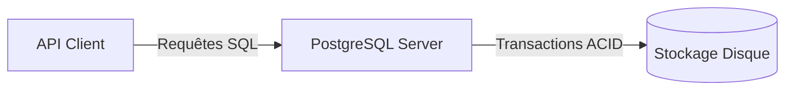

# Tech Tutor Examples

This file contains example interactions to guide the agent when executing the `tutor` skill.

---

## Example 1: Tech Choice (ADR summary)

**User**: Explain why we chose PostgreSQL for this project and make a TLDR.

**Agent response**:
### 🗄️ Choix Technologique : PostgreSQL (ADR TLDR)

* **Contexte** : Nous avions besoin d'un système de gestion de base de données relationnelle robuste pour stocker des données financières structurées avec des transactions garanties ACID.
* **Décision** : Utiliser **PostgreSQL** hébergé en local.
* **Conséquences** :
  * *Avantages* : Conformité ACID stricte, richesse des types de données (JSONB, tableaux), extensibilité et communauté solide.
  * *Inconvénients* : Plus complexe à configurer et à mettre à l'échelle horizontalement qu'une base NoSQL (comme MongoDB).



---

## Example 2: Mathematical / Algorithm Explanation (Sorting)

**User**: Explique-moi le fonctionnement de l'algorithme Quicksort en détail.

**Agent response**:
### ⚡ Algorithme de Tri Rapide (Quicksort)

L'algorithme **Quicksort** est basé sur le paradigme "Diviser pour régner" (Divide and Conquer).

#### 1. Le principe du pivot
L'idée est de choisir un élément dans le tableau (appelé **pivot**) et de réorganiser les autres éléments :
* Tous les éléments **inférieurs** au pivot sont déplacés à sa gauche.
* Tous les éléments **supérieurs** au pivot sont déplacés à sa droite.

Une fois cette étape (le *partitionnement*) terminée, le pivot est à sa place définitive.

```
Tableau initial:  [5, 2, 9, 3, 7, 6, 1]  (Pivot choisi = 5)
Après partition:  [2, 3, 1] < 5 < [9, 7, 6]
Recurrence:       Quicksort(gauche) + [5] + Quicksort(droite)
```

#### 2. Complexité Temporelle
* **Dans le meilleur des cas (partition équilibrée)** : $\mathcal{O}(N \log N)$
* **Dans le pire des cas (tableau déjà trié et mauvais choix de pivot)** : $\mathcal{O}(N^2)$

---

## Example 3: Quiz/Tutoring Mode

**User**: Je voudrais que tu testes mes connaissances sur les bases de données NoSQL.

**Agent response**:
### 🎓 Quiz d'apprentissage : NoSQL (Niveau 1)

Voici votre première question. Répondez simplement et je vous guiderai :

**Question** : Quelle est la différence fondamentale entre une base de données de type Clé-Valeur (comme Redis) et une base de données orientée Documents (comme MongoDB) en termes de structure de stockage ? 

*À vous de jouer, j'attends votre réponse !*

---

## Example 4: Notion Synchronization & Export

**User**: Exporte les connaissances sur Quicksort sur ma page Notion.

**Agent response**:
*(L'agent vérifie `NOTION_TOKEN` dans son environnement, charge `.env`, demande ou récupère la page parente cible, puis exécute le code d'exportation avec l'API Notion)*

### 📤 Exportation vers Notion réussie !

J'ai créé une sous-page **"Algorithme Quicksort (Tri Rapide)"** sous votre page principale Notion.

Vous pouvez y accéder directement via l'URL générée par l'intégration :
👉 [Lien vers votre sous-page Notion](https://www.notion.so/votre-sous-page-generee-par-l-api)
