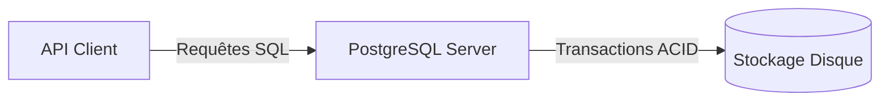

# Example: Tech Choice (ADR summary)

**User**: Explain why we chose PostgreSQL for this project and make a TLDR.

**Agent response**:
### 🗄️ Choix Technologique : PostgreSQL (ADR TLDR)

* **Contexte** : Nous avions besoin d'un système de gestion de base de données relationnelle robuste pour stocker des données financières structurées avec des transactions garanties ACID.
* **Décision** : Utiliser **PostgreSQL** hébergé en local.
* **Conséquences** :
  * *Avantages* : Conformité ACID stricte, richesse des types de données (JSONB, tableaux), extensibilité et communauté solide.
  * *Inconvénients* : Plus complexe à configurer et à mettre à l'échelle horizontalement qu'une base NoSQL (comme MongoDB).

*(L'agent écrit le diagramme dans un fichier `diagrams/postgresql-architecture.mmd` plutôt que de l'inliner dans le chat)*

J'ai généré le schéma d'architecture dans le fichier **`diagrams/postgresql-architecture.mmd`** :

